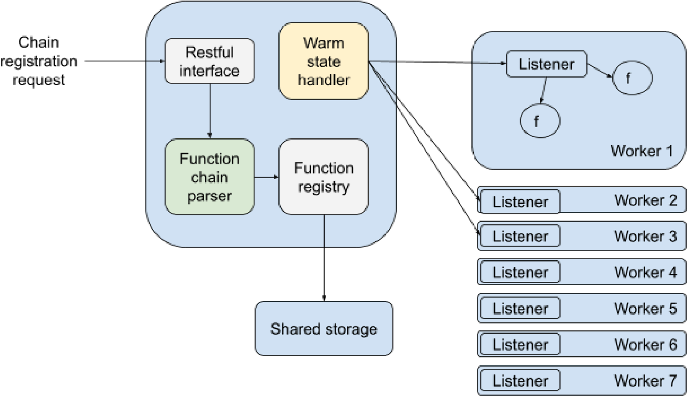
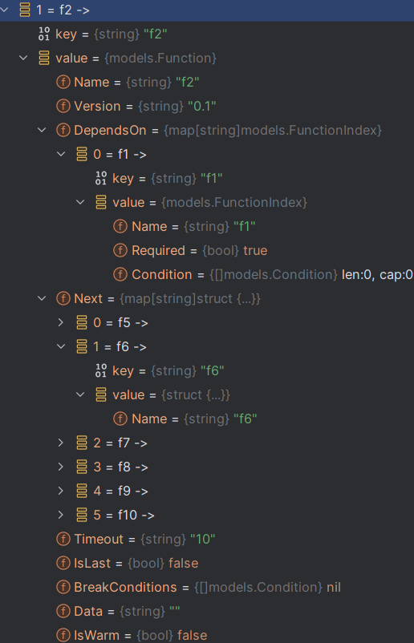

# NCSU_GEARS

This repository is for the NCSU_GEARS summer program(Topic: Serverless).

## Tasks 1 & 2

### Distribution of Workload
Yang: Task 1

Zhe: Task 2

### Project Structure:



### Tasks Description:

Task 1: Parse the input function chain and convert it into the desired format:

We are expecting to receive a JSON-formatted function chain description from the customer. A sample of such a JSON is attached to this email in the "Gears-Task1" file.

Unfortunately, using the input data as is, would lead to suboptimal performance since we first need to access all the entries in the top-level JSON to identify the correct function. Then further nesting complicates the parsing more.

Thus, the task is to convert this JSON into a format/data structure, which allows us to have a faster access to the metadata whenever needed. An example approach could be to have it converted into a hashmap with function name as the key and function data/metadata hashmap, as the value. This is just for example. You can think of other approaches also. It's just that we want to have as fast as possible access to all the function metadata.

As a target, consider parsing the JSON into a format/data structure that allows O(1) access to version, timeout, isLast, next, and dependsOn fields for each function. Further, next and dependsOn should also be parsed to allow O(1) access to the metadata of each dependent function in the respective list.

Our aim is to run this on the function chain as soon as the customer registers it, so that all the executions of the function chain would run on this faster accessible data structure.


Task 2: Implement parallel execution of warm state handling:

In our current setup, we maintain some functions in a warm state while the other functions are being executed, to ensure low cold start times. If you are not already aware, please read about cold start times in serverless computing.

However, in the current state of the code, when a warm function executes, we update the warm state array after the execution of the said function, which could lead to the cold start problem not being solved at all.

Therefore, the task is to use multi-threading/goroutines to enable parallel updates to the warm state queue while the current function is being executed. The point to take care of is that the warm state update thread time should be the limiting one. Thus, even if the function execution completes before the warm state update, the program shall wait for the warm state update to complete.

I have attached the relevant code snippet with this email for your reference. Kindly go through this code snippet and implement this parallel warm state update. Note that warm state updates that need to be parallelized are happening in the "RunFunction" function. There are "Todo" comments for identification of the relevant part.

Note that some code has been removed to create this relevant code snippet. So, if any part of the code is unclear, let me know and we can discuss it.


## Task: JSON Parse & Warm State Updating
### How to Run:
```shell
cd ${APPROOT}/tests
go test -run TestForTask1And2
```
### Result & Explanation
#### Experiment Configurations:
```yaml
numParallel: 2
functionsIter: 0
```
#### Experiment Results For JSON Parse:
Target go entity structure:
```go
type Function struct {
	Name            string
	Version         string
	DependsOn       map[string]FunctionIndex
	Next            map[string]struct{ Name string }
	Timeout         string
	IsLast          bool
	BreakConditions []Condition
	Data            string
	IsWarm          bool
}
```
Parsed result:



#### Experiment Results For Warm State Updating:
```shell
=== RUN   TestForTask1And2
time="2023-08-09T00:03:11-04:00" level=info msg="GoRoutineId: 34 function: f8 with parameters: data7 has been well processed"
time="2023-08-09T00:03:11-04:00" level=info msg="GoRoutineId: 7 WarmStateUpdateEventHandler received event, updating warm state now..."
time="2023-08-09T00:03:11-04:00" level=info msg="GoRoutineId: 34 Result for function: map[f8:processed]\n"
time="2023-08-09T00:03:11-04:00" level=info msg="GoRoutineId: 50 function: f4 with parameters: data3 has been well processed"
time="2023-08-09T00:03:11-04:00" level=info msg="GoRoutineId: 7 WarmStateUpdateEventHandler received event, updating warm state now..."
time="2023-08-09T00:03:11-04:00" level=info msg="GoRoutineId: 50 Result for function: map[f4:processed f8:processed]\n"
time="2023-08-09T00:03:11-04:00" level=info msg="GoRoutineId: 66 function: f10 with parameters: data9 has been well processed"
time="2023-08-09T00:03:11-04:00" level=info msg="GoRoutineId: 66 Result for function: map[f10:processed f4:processed f8:processed]\n"
time="2023-08-09T00:03:11-04:00" level=info msg="GoRoutineId: 7 WarmStateUpdateEventHandler received event, updating warm state now..."
time="2023-08-09T00:03:11-04:00" level=info msg="GoRoutineId: 36 function: f11 with parameters: data10 has been well processed"
time="2023-08-09T00:03:11-04:00" level=info msg="GoRoutineId: 7 WarmStateUpdateEventHandler received event, updating warm state now..."
time="2023-08-09T00:03:11-04:00" level=info msg="GoRoutineId: 36 Result for function: map[f10:processed f11:processed f4:processed f8:processed]\n"
time="2023-08-09T00:03:11-04:00" level=info msg="GoRoutineId: 37 function: f1 with parameters: data0 has been well processed"
time="2023-08-09T00:03:11-04:00" level=info msg="GoRoutineId: 7 WarmStateUpdateEventHandler received event, updating warm state now..."
time="2023-08-09T00:03:11-04:00" level=info msg="GoRoutineId: 37 Result for function: map[f1:processed f10:processed f11:processed f4:processed f8:processed]\n"
time="2023-08-09T00:03:11-04:00" level=info msg="GoRoutineId: 39 function: f2 with parameters:  has been well processed"
time="2023-08-09T00:03:11-04:00" level=info msg="GoRoutineId: 7 WarmStateUpdateEventHandler received event, updating warm state now..."
time="2023-08-09T00:03:11-04:00" level=info msg="GoRoutineId: 7 WarmStateUpdateEventHandler received event, updating warm state now..."
time="2023-08-09T00:03:11-04:00" level=info msg="GoRoutineId: 39 Result for function: map[f1:processed f10:processed f11:processed f2:processed f4:processed f8:processed]\n"
time="2023-08-09T00:03:11-04:00" level=info msg="GoRoutineId: 40 function: f3 with parameters:  has been well processed"
time="2023-08-09T00:03:11-04:00" level=info msg="GoRoutineId: 40 Result for function: map[f1:processed f10:processed f11:processed f2:processed f3:processed f4:processed f8:processed]\n"
time="2023-08-09T00:03:11-04:00" level=info msg="GoRoutineId: 69 function: f7 with parameters:  has been well processed"
time="2023-08-09T00:03:11-04:00" level=info msg="GoRoutineId: 7 WarmStateUpdateEventHandler received event, updating warm state now..."
time="2023-08-09T00:03:11-04:00" level=info msg="GoRoutineId: 69 Result for function: map[f1:processed f10:processed f11:processed f2:processed f3:processed f4:processed f7:processed f8:processed]\n"
time="2023-08-09T00:03:11-04:00" level=info msg="GoRoutineId: 71 function: f9 with parameters:  has been well processed"
time="2023-08-09T00:03:11-04:00" level=info msg="GoRoutineId: 7 WarmStateUpdateEventHandler received event, updating warm state now..."
time="2023-08-09T00:03:11-04:00" level=info msg="GoRoutineId: 71 Result for function: map[f1:processed f10:processed f11:processed f2:processed f3:processed f4:processed f7:processed f8:processed f9:processed]\n"
time="2023-08-09T00:03:11-04:00" level=info msg="GoRoutineId: 7 WarmStateUpdateEventHandler received event, updating warm state now..."
time="2023-08-09T00:03:11-04:00" level=info msg="GoRoutineId: 74 function: f6 with parameters:  has been well processed"
time="2023-08-09T00:03:11-04:00" level=info msg="GoRoutineId: 73 function: f5 with parameters:  has been well processed"
time="2023-08-09T00:03:11-04:00" level=info msg="GoRoutineId: 7 WarmStateUpdateEventHandler received event, updating warm state now..."
time="2023-08-09T00:03:11-04:00" level=info msg="GoRoutineId: 74 Result for function: map[f1:processed f10:processed f11:processed f2:processed f3:processed f4:processed f6:processed f7:processed f8:processed f9:processed]\n"
time="2023-08-09T00:03:11-04:00" level=info msg="GoRoutineId: 73 Result for function: map[f1:processed f10:processed f11:processed f2:processed f3:processed f4:processed f5:processed f6:processed f7:processed f8:processed f9:processed]\n"
time="2023-08-09T00:03:11-04:00" level=info msg="GoRoutineId: 7 WarmStateUpdateEventHandler received event, updating warm state now..."
time="2023-08-09T00:03:11-04:00" level=info msg="GoRoutineId: 54 function: f12 with parameters:  has been well processed"
time="2023-08-09T00:03:11-04:00" level=info msg="GoRoutineId: 54 Result for function: map[f1:processed f10:processed f11:processed f12:processed f2:processed f3:processed f4:processed f5:processed f6:processed f7:processed f8:processed f9:processed]\n"
time="2023-08-09T00:03:11-04:00" level=info msg="GoRoutineId: 7 WarmStateUpdateEventHandler received event, updating warm state now..."
time="2023-08-09T00:03:11-04:00" level=info msg="GoRoutineId: 76 function: f13 with parameters:  has been well processed"
time="2023-08-09T00:03:11-04:00" level=info msg="GoRoutineId: 76 Result for function: map[f1:processed f10:processed f11:processed f12:processed f13:processed f2:processed f3:processed f4:processed f5:processed f6:processed f7:processed f8:processed f9:processed]\n"
--- PASS: TestForTask1And2 (1.00s)
PASS
```
#### Explanation
1. The json strings were mapped to "map[string]models.function" and kept O(1) access to the metadata.
2. "dependsOn" and "next" fields has been modified to "map[string]models.function" to remain O(1) access instead of traversing all the json again.
3. For each call to "ScheduleFunctionOnNode()", the main GoRoutine(GoRoutineId: 1) will wait for the user function GoRoutine and warm state update GoRoutine.
4. Use mutex lock to remain thread-safe: Could be switched to read-write lock if reading is significantly larger than writing.
5. Add a WarmStateUpdateEventHandler to maintain warm state once a request(event) comes.
6. Update test code to simulate concurrency scenarios.

## Task: Rest-api

### Distribution of Workload
Yang: Task 1
1. Organize rest-api functions
2. Finish the code for controller and service 

Zhe: Task 2
1. Improve json conversion tools
2. Design code functional structure
3. Finish unit test for rest-api

### Tasks Description:
Task: Develop a module that exposes an API which would be used by the user to register a function chain with the platform. The specifications of the API is as follows:

Type: Preferably REST API
Protocol: HTTP(s) (HTTPS would need SSL certificate, so you can use HTTP for now, we'll extend it later to include HTTPS)
Method: POST
Path: /registerFunctionChain
Data: The JSON sample shared earlier
Response: 200 OK if the input is valid JSON as per our requirements (schema), else a 400 Bad Request.

### How to Run:
```shell
# Make sure port 8443 is available, or modify it in ${APPROOT}/resources/application.yaml
cd ${APPROOT}/tests
./autoRunRestApiTest.sh
```

### Result & Explanation
#### Experiment Configurations:
```yaml
port: 8443
```

#### Experiment Results:
```shell
INFO[0000] starting serving on port: :8443              
INFO[0000] Response status:200 OK                       
INFO[0000] Response body:"fc1"                          
PASS
ok      NCSU_Gears/tests        0.033s
```

#### Explanation
1. Server Start-Up: In the RegisterFunctionChainController function, a new Gorilla Mux router is created and the registerEchoFunctionChainHandler is registered as the handler for POST requests. An HTTP server is then initiated to listen on a specified port and handle requests with the created router. 
2. Request Handling: In the registerEchoFunctionChainHandler function, the request body is read and parsed into the RegisterFunctionChainVO structure. The parsed data is then processed by the ParseJsonToMaps function and the results are stored in the global RegisteredFunctionChainsMap. 
3. Response Sending: If the processing is successful, the registerEchoFunctionChainHandler function sets the HTTP status code to 200 and returns the identifier of the processed result. 
4. Request Sending: A new POST request is created, with the body being data read from a JSON file. This request is then sent using an HTTP client. 
5. Response Checking: The status and body of the response are read, and the status is checked to be "200 OK" using the assert function from Testify.
6. Self-issued certification for https is enabled.

### Performance Tests
#### Experiment Configurations:
```yaml
test:
  performance:
    request_time: 100
    request_threads: 100
```

### How to Run:
```shell
# Make sure port 8443 is available, or modify it in ${APPROOT}/resources/application.yaml
cd ${APPROOT}/tests
./autoRunRestApiTest.sh
```

### Test environment:
```yaml
CPU: AMD Ryzen 7 6800H with Radeon Graphics
  - 1 physical CPU package(s)
  - 8 physical CPU core(s)
  - 16 logical CPU(s)
Identifier: AuthenticAMD Family 25 Model 68 Stepping 1
Microarchitecture: Zen 3
Available cores: 16
Total Memory: 13434
Operating System: Linux DESKTOP-LUP6PO5 5.15.90.1-microsoft-standard-WSL2
```

#### Experiment Results:
##### Echo
Average response time: 247 ms
Resource usage:
![]
CPU usage detail:

Memory usage detail:

##### Gorilla/Mux
Average response time: 245 ms
Resource usage:

CPU usage detail:

Memory usage detail:


#### Explanation
This performance test is based on FunctionChainRegistration's REST-API (self-signed HTTPS), with a request body type of application/json. The web framework type can be modified in ${APPROOT/resources/application.yaml}. The test code will simulate 100 consecutive requests from 100 users after the web service is started (the total number of requests is 10, 000, this configuration can also be modified in ${APPROOT/resources/application.yaml})

From the results, there is no significant difference between the two web frameworks (Gorilla/mux and Echo) in the current test scenario: the average response time, CUP usage and memory usage are all in the same order of magnitude. However, it is worth noting that the Gorilla/mux framework has a significantly lower footprint for web service-related code than Echo. Based on the above results and the official documentation, we believe that Echo contains more features and is more suitable for complete product-level services, while Gorilla/mux is lighter, and in the experimental stage, it is fully capable of carrying simple routing and web proxy functions.